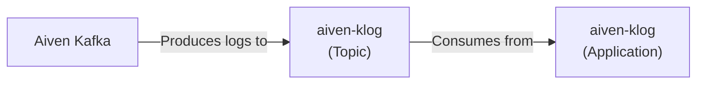

# aiven-klog

aiven-klog consumes logs from Aiven Kafka and outputs them to stdout for ingestion.

- Aiven Kafka produces logs to the `aiven-klog` topic. This is configured through the `ServiceIntegration` resource.
- The `aiven-klog` application consumes logs from the `aiven-klog` topic and outputs them to stdout, available for re-ingestion.
